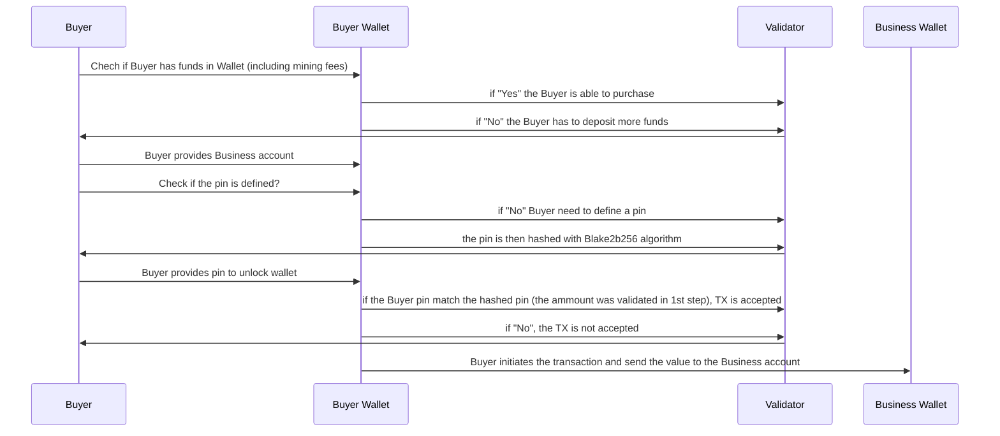

## Freestyle Day 2
#### Homework
Design a Single Stage Tx (where there's only 1 contract involved).

Explain the:

    1. Transaction
    2. What's the tx about
    3. The tx in real life (if applicable, describe in steps)
    4. The tx in eUTxO system
    5. Smart contracts in english words (You can try code too if you'd like, but you have to have the english words alongside it)

---
Solutions:

    1. A transaction is an exchange of Value and/or Data.
    2. This is a simple transaction between a Buyer and a Business, that assumes  a “working wallets”
    3. See "diagram below"
    4. An eUTXO TX is created with Input and Output values/data.
        4.1. When a TX occurs, the sum of both (Input and Output) values must equal
    5. See "pin_lock.scala"

